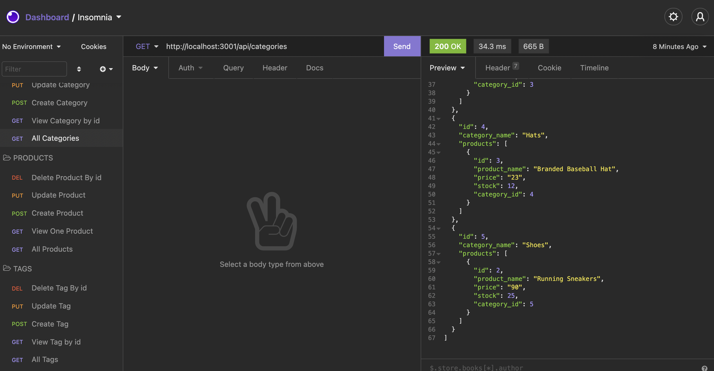
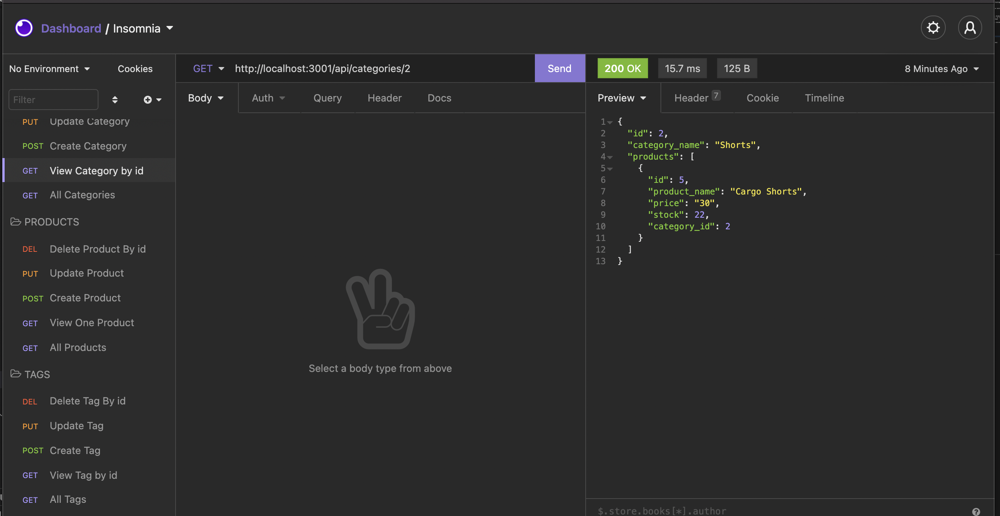

# e-commerce_back-end

## Description
🔍 An application to build the back end for an e-commerce site. Taking a working Express.js API and configure it to use Sequelize to interact with a MySQL database.

# User Story
AS A manager at an internet retail company
I WANT a back end for my e-commerce website that uses the latest technologies
SO THAT my company can compete with other e-commerce companies

GIVEN a functional Express.js API
WHEN I add my database name, MySQL username, and MySQL password to an environment variable file
THEN I am able to connect to a database using Sequelize
WHEN I enter schema and seed commands
THEN a development database is created and is seeded with test data
WHEN I enter the command to invoke the application
THEN my server is started and the Sequelize models are synced to the MySQL database
WHEN I open API GET routes in Insomnia Core for categories, products, or tags
THEN the data for each of these routes is displayed in a formatted JSON
WHEN I test API POST, PUT, and DELETE routes in Insomnia Core
THEN I am able to successfully create, update, and delete data in my database

## Built with 
* JAVASCRIPT
* MYSQL
* MYSQL2
* NODE.JS
* EXPRESS.JS
* SEQUELIZE
* NPM

# Link to README video 
🎥 Tutorial video for Categories can be found [here](https://drive.google.com/file/d/1SFu1ltjkcJqkN6krJ0RWLciHk-zBy-bK/view) 
🎥 FTutorial video for Products can be found [here](https://drive.google.com/file/d/1UsXFTm43gHwNcd1JD8na6fRooTj3LMcu/view) 
🎥 FTutorial video for Tags can be found [here](https://drive.google.com/file/d/1rMX5sDaVpQ0FjFp4upN1yLXk8a5_LdBA/view) 

## Contribution
Made with ❤️ by Maame

